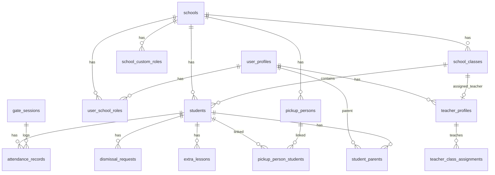

# MyEduRide Gate Manager — Developer Reference

Complete reference for building on this codebase: database schema, data model, authentication, and **every API endpoint**.

> **Database setup:** Run [`../schema.sql`](../schema.sql) in the Supabase SQL Editor. That file is the **single source of truth** — there are no separate migration files. This folder holds documentation only.

---

## Table of contents

1. [Architecture overview](#architecture-overview)
2. [Environment variables](#environment-variables)
3. [Authentication](#authentication)
4. [Timezone & timestamps](#timezone--timestamps)
5. [Photo storage](#photo-storage)
6. [Data model](#data-model)
7. [Roles & access control](#roles--access-control)
8. [Core business flows](#core-business-flows)
9. [API reference](#api-reference)
   - [Auth](#auth)
   - [Data hub (POST /api/data)](#data-hub-post-apidata)
   - [Schools](#schools)
   - [Classes](#classes)
   - [Students](#students)
   - [Staff](#staff)
   - [Setup wizard](#setup-wizard)
   - [Gate](#gate)
   - [Teacher](#teacher)
   - [Attendance & reports](#attendance--reports)
   - [Pickup persons & requests](#pickup-persons--requests)
   - [Parents](#parents)
   - [Notifications & push](#notifications--push)
   - [ID cards & photos](#id-cards--photos)
   - [Face enrollment](#face-enrollment)
10. [Realtime tables](#realtime-tables)
11. [Extending the platform](#extending-the-platform)

---

## Architecture overview

```
┌─────────────┐     cookie: myeduride_session     ┌──────────────────┐
│  Next.js    │ ────────────────────────────────► │  /api/* routes   │
│  dashboards │                                 │  (App Router)    │
└─────────────┘                                 └────────┬─────────┘
                                                         │ service role
                                                         ▼
                                                ┌──────────────────┐
                                                │  Supabase        │
                                                │  Postgres + Auth │
                                                │  Storage (photos)│
                                                └──────────────────┘
```

- **Frontend:** Next.js App Router (`src/app/dashboard/*`)
- **Backend:** Next.js Route Handlers (`src/app/api/**/route.ts`)
- **Database:** Supabase Postgres — schema in [`../schema.sql`](../schema.sql)
- **Auth:** Email OTP → session cookie `myeduride_session` (JSON, not JWT)
- **Storage:** Private `photos` bucket; images served via `/api/photo?path=…`
- **Email:** Resend (OTP, welcome, pickup, dismissal)
- **Push:** Web Push (VAPID keys)

All API routes use `getAdminClient()` (Supabase **service role**) and enforce access in application code via `getSessionFromRequest()`.

---

## Environment variables

Copy `.env.local.example` to `.env.local`:

| Variable | Purpose |
|----------|---------|
| `NEXT_PUBLIC_SUPABASE_URL` | Supabase project URL |
| `NEXT_PUBLIC_SUPABASE_ANON_KEY` | Client-side Supabase (middleware) |
| `SUPABASE_SERVICE_ROLE_KEY` | **Required** for all API routes |
| `RESEND_API_KEY` | OTP + notification emails |
| `NEXT_PUBLIC_VAPID_PUBLIC_KEY` | Web push (client) |
| `VAPID_PRIVATE_KEY` | Web push (server) |
| `NEXT_PUBLIC_APP_URL` | Links in emails |
| `SUPER_ADMIN_EMAILS` | Comma-separated super admin emails |

---

## Authentication

### Login flow

1. `POST /api/auth/send-otp` — `{ email }` → sends 6-digit code (10 min TTL)
2. `POST /api/auth/verify-otp` — `{ email, code }` → sets cookie + returns user/roles

### Session cookie

**Name:** `myeduride_session`

```json
{
  "user_id": "uuid",
  "email": "user@school.com",
  "full_name": "Jane Doe",
  "roles": [
    { "role": "teacher", "school_id": "uuid" },
    { "role": "school_admin", "school_id": "uuid" }
  ]
}
```

**Usage in API routes:**

```ts
import { getSessionFromRequest, sessionHasRole } from '@/lib/session';

const session = getSessionFromRequest(request);
if (!session) return NextResponse.json({ error: 'Not authenticated' }, { status: 401 });
```

**Client requests:** always send `credentials: 'include'`.

---

## Timezone & timestamps

- **App timezone:** `Africa/Lagos` (UTC+1, WAT)
- **Storage:** all timestamps in Postgres as `TIMESTAMPTZ` (UTC)
- **Display:** use helpers in `src/lib/timezone.ts` and `src/lib/attendance/lagos-dates.ts`
- **Calendar days:** attendance/dismissal use Lagos date keys (`todayInLagos()`, `lagosDayBounds()`)

Never use raw `new Date().toISOString().split('T')[0]` for business logic — use Lagos helpers.

---

## Photo storage

| Path pattern | Entity |
|--------------|--------|
| `logos/{schoolId}.jpg` | School logo |
| `students/{schoolId}/{studentId}.jpg` | Student photo |
| `staff/{schoolId}/{staffIdNumber}.jpg` | Staff photo |
| `pickup/{schoolId}/{uuid}.jpg` | Pickup person photo |

- Bucket: `photos` (private, 5 MB, JPEG/PNG/WebP)
- DB columns store **storage path**, not public URL
- Display: `GET /api/photo?path=logos/{uuid}.jpg`
- Upload logos: `POST /api/schools/logo` (multipart)
- Generic upload: `POST /api/upload` (base64, any folder — prefer scoped endpoints)

---

## Data model

### Entity relationship (simplified)



### Tables reference

| Table | Purpose | Key columns |
|-------|---------|-------------|
| `schools` | Tenant root | `name`, `logo_url`, gate times, `setup_completed`, `timezone` |
| `school_classes` | Class groups | `name`, `grade`, `section`, `assigned_teacher_id` |
| `school_custom_fields` | Dynamic form fields | `entity_type` (`student`/`teacher`), `field_type`, `options` |
| `school_custom_roles` | Job titles (Accountant, Driver…) | `name`, `slug`, `can_assign_class` |
| `user_profiles` | All users | `email`, `full_name`, `phone` — FK to `auth.users` |
| `user_school_roles` | RBAC | `role`, `school_id`, `is_active` |
| `teacher_profiles` | Staff ID + QR + photo | `staff_id_number`, `qr_code_data`, `custom_role_id` |
| `teacher_class_assignments` | Teacher ↔ class links | `teacher_profile_id`, `class_id`, `is_primary` |
| `students` | Enrolled children | `student_id_number`, `qr_code_data`, `class_id`, `custom_fields` |
| `student_parents` | Parent ↔ student links | `parent_user_id`, `relationship` |
| `gate_sessions` | Gate officer shift | `mode` (`arrival`/`dismissal`), `status` |
| `attendance_records` | Student check-in/out | `type`, `status`, `source`, `minutes_late`, `timestamp` |
| `staff_attendance` | Staff clock in/out | `type` (`clock_in`/`clock_out`) |
| `dismissal_requests` | Ready for pickup queue | `status`, `dismissal_date` — **UNIQUE(student_id, dismissal_date)** |
| `extra_lessons` | After-school hold | `is_released`, `date` — **UNIQUE(student_id, date)** |
| `pickup_persons` | Authorised collectors | `name`, `relationship`, `phone`, `photo_url` |
| `pickup_person_students` | Person ↔ student M:N | |
| `pickup_notices` | Parent daily notice | `pickup_person_name`, `notice_date` |
| `pickup_requests` | Parent message to admin | `status` (`pending`/`acknowledged`/`completed`) |
| `notifications` | In-app inbox | `type`, `is_read`, `email_sent`, `push_sent` |
| `push_subscriptions` | Web push endpoints | |
| `otp_codes` | Login codes | `expires_at`, `used` |
| `school_non_school_days` | Holidays/closures | `day_type`, `batch_id`, `range_end_date` |

### Enum values (CHECK constraints)

**`user_school_roles.role`:** `super_admin`, `school_admin`, `teacher`, `gate_officer`, `parent`, `staff`

**`attendance_records.type`:** `arrival`, `departure`

**`attendance_records.status`:** `on_time`, `late`, `absent`

**`attendance_records.source`:** `gate`, `teacher`

**`attendance_records.verification_method`:** `face_recognition`, `id_card_scan`, `manual`, `teacher_manual`

**`dismissal_requests.status`:** `pending`, `approved`, `completed`

**`notifications.type`:** `arrival`, `departure`, `late`, `dismissal`, `system`, `pickup_request`, `pickup_person`

---

## Roles & access control

| Role | Dashboard | Typical API access |
|------|-----------|-------------------|
| `super_admin` | `/dashboard/super-admin` | All schools, create/delete schools, ID cards |
| `school_admin` | `/dashboard/school-admin` | Full school CRUD, settings, reports |
| `teacher` | `/dashboard/teacher` | Own class, ready-for-pickup, scan, reports (class) |
| `gate_officer` | `/dashboard/gate` | Scan, accept, release, ready queue |
| `staff` | `/dashboard/staff` | Own attendance history |
| `parent` | `/dashboard/parent` | Children, history, pickup persons, notify school |

**Staff ID format:** `STF-{schoolPrefix}-{timestamp}` (generated by `ensureStaffProfile`)

**Student ID format:** assigned at enrollment (unique globally)

**QR format:** `MYEDURIDE:STAFF:{staff_id_number}` or student `qr_code_data`

---

## Core business flows

### 1. Morning arrival

```
Gate scan QR → POST /api/gate/scan → POST /api/gate/accept (type: arrival)
  → attendance_records insert
  → parent notification (email + push)
```

### 2. Teacher dismissal (Ready for Pickup)

```
Teacher → POST /api/teacher/ready-for-pickup
  → dismissal_requests (pending) — blocked if already exists today
  → parents + gate officers notified
Gate → GET /api/gate/dashboard (pickup_queue)
  → POST /api/gate/accept (type: departure, from_ready_queue: true)
  → dismissal_requests.status = completed
```

### 3. Extra lesson

```
Teacher → POST /api/teacher/extra-lesson { action: "add" }
  → student hidden from active dismissal list
Teacher → POST /api/teacher/extra-lesson { action: "release" }
  → auto-calls ready-for-pickup
```

### 4. Parent pickup notification

```
Parent → POST /api/pickup-requests
  → pickup_requests + notifications to school_admin/gate_officer
Admin → PATCH /api/pickup-requests { status: "acknowledged" }
```

---

## API reference

**Base URL:** `{NEXT_PUBLIC_APP_URL}/api`

**Common headers:**
- JSON endpoints: `Content-Type: application/json`
- All authenticated calls: `credentials: 'include'`

**Common errors:** `401` not authenticated · `403` access denied · `404` not found · `409` conflict (duplicate action)

---

### Auth

#### `POST /api/auth/send-otp`

Send login code to registered email.

**Body:**
```json
{ "email": "teacher@school.com" }
```

**Response:** `{ "success": true }`

**Errors:** `404` email not registered

---

#### `POST /api/auth/verify-otp`

Verify code and create session.

**Body:**
```json
{ "email": "teacher@school.com", "code": "123456" }
```

**Response:**
```json
{
  "success": true,
  "user": { "id": "uuid", "email": "...", "full_name": "..." },
  "roles": [{ "role": "teacher", "school_id": "uuid" }]
}
```

Sets cookie `myeduride_session`.

---

### Data hub (`POST /api/data`)

Central RPC-style endpoint for dashboard data. All actions require session cookie.

**Body:**
```json
{ "action": "ACTION_NAME", "params": { } }
```

| Action | Params | Returns | Used by |
|--------|--------|---------|---------|
| `get_school_admin_data` | `{ role?: "school_admin" }` | `{ school, school_id }` | School admin layout |
| `get_school_dashboard` | `{ school_id }` | Stats, recent activity | Admin + super-admin school view |
| `get_teacher_dashboard` | — | Students + present/absent counts | Teacher (legacy) |
| `get_teacher_dashboard_full` | — | + `ready_for_pickup`, `in_extra_lesson` | Teacher dashboard |
| `get_staff_dashboard` | — | `{ school_id, school_name, job_title }` | Staff dashboard |
| `get_parent_children` | — | `{ children[] }` | Parent dashboard |
| `get_parent_notifications` | — | `{ notifications[] }` | Parent inbox |
| `mark_notification_read` | `{ notification_id }` | `{ success: true }` | Any dashboard |
| `get_students` | `{ school_id }` | `{ students[] }` | Admin lists |
| `get_classes` | `{ school_id }` | `{ classes[] }` with student counts | Admin, super-admin |
| `get_custom_fields` | `{ school_id }` | `{ fields[] }` | Setup, forms |
| `query` | `{ table, select, filters, order, limit }` | `{ data[] }` | Generic read (use carefully) |

**Example:**
```bash
curl -X POST /api/data \
  -H "Content-Type: application/json" \
  -b "myeduride_session=..." \
  -d '{"action":"get_teacher_dashboard_full","params":{}}'
```

---

### Schools

#### `GET /api/schools/list`

**Auth:** `super_admin`

**Response:** `{ schools: [{ ...school, student_count, staff_count }], count }`

---

#### `POST /api/schools/create`

**Auth:** `super_admin`

**Body:**
```json
{
  "name": "Greenfield Academy",
  "address": "Lagos",
  "admin_email": "admin@greenfield.com",
  "admin_name": "John Admin",
  "admin_phone": "+234..."
}
```

**Response:** `{ success: true, school_id, school }`

Also creates: default custom fields, default job roles, `school_admin` role, staff profile with ID.

**Logo:** upload separately via `POST /api/schools/logo` after create.

---

#### `POST /api/schools/delete`

**Auth:** `super_admin` · **Body:** `{ school_id }`

---

#### `GET /api/schools/settings?school_id=`

**Auth:** school admin for that school

**Response:** `{ school, time_columns_available }`

---

#### `PUT /api/schools/settings`

**Auth:** school admin · **Body:** `{ school_id, name, address, logo_url, primary_color, secondary_color, gate_open_time, ... }`

---

#### `POST /api/schools/logo`

**Auth:** `super_admin` or `school_admin` for school

**Content-Type:** `multipart/form-data`

| Field | Type |
|-------|------|
| `school_id` | string |
| `file` | image (JPG/PNG/WebP, max 5 MB) |

**Response:** `{ success: true, path, preview_url }`

---

#### `GET /api/schools/students?school_id=`

**Auth:** school staff or super_admin · **Response:** `{ students[] }` with class embed

---

#### `GET /api/schools/staff?school_id=&ensure_profiles=1`

**Auth:** school staff or super_admin

| Query | Purpose |
|-------|---------|
| `ensure_profiles=1` | Backfill missing `teacher_profiles` + staff IDs |

**Response:**
```json
{
  "staff": [{
    "id": "role-row-uuid",
    "role": "teacher",
    "job_title": "teacher",
    "profile": { "full_name", "email" },
    "staff": { "staff_id_number", "qr_code_data", "photo_url" }
  }]
}
```

---

#### `GET /api/schools/custom-roles?school_id=`

List job titles. **POST** to create, **DELETE** to remove.

**POST body:** `{ school_id, name, can_assign_class }`

---

#### `GET /api/schools/calendar?school_id=&from=&to=`

Non-school days (holidays). **POST** to add, **DELETE** to remove.

---

### Classes

#### `GET /api/classes?school_id=`

**Auth:** school admin or super_admin

**Response:** `{ classes[] }` with `assigned_teacher`, `student_count`

---

#### `POST /api/classes`

**Body:** `{ school_id, name, grade, section?, assigned_teacher_id? }`

---

#### `PUT /api/classes`

**Body:** `{ id, school_id, name?, grade?, section?, assigned_teacher_id? }`

---

#### `DELETE /api/classes`

**Body:** `{ id, school_id }` — soft-delete (`is_active: false`); blocked if active students exist

---

### Students

#### `POST /api/students/create`

**Body:** `{ school_id, class_id, first_name, last_name, custom_fields, photo_base64?, parent_email, parent_name, ... }`

Creates student, QR code, optional photo, parent account + link.

---

#### `POST /api/students/update`

**Body:** `{ student_id, ...fields }`

---

#### `POST /api/students/delete`

**Body:** `{ student_id }` — soft-delete

---

### Staff

#### `POST /api/staff/create`

**Body:**
```json
{
  "email": "teacher@school.com",
  "full_name": "Jane Teacher",
  "phone": "+234...",
  "role": "teacher|staff|gate_officer|school_admin",
  "school_id": "uuid",
  "class_id": "uuid",
  "custom_role_id": "uuid",
  "photo_base64": "data:image/jpeg;base64,...",
  "face_descriptor": [],
  "skip_face": false
}
```

- `staff` role **requires** `custom_role_id`
- `teacher` / staff with `can_assign_class` may have `class_id`
- Creates `user_profiles`, `user_school_roles`, `teacher_profiles` with `STF-…` ID

---

#### `POST /api/staff/delete`

**Body:** `{ role_id }` — deactivates role row

---

#### `POST /api/staff/attendance`

Staff self-service attendance log (from staff dashboard).

---

### Setup wizard

Used during first-time school onboarding (`setup_completed: false`).

| Endpoint | Purpose |
|----------|---------|
| `POST /api/setup/classes` | Bulk create classes |
| `POST /api/setup/fields` | Configure custom fields |
| `POST /api/setup/complete` | Mark `setup_completed: true` |

---

### Gate

#### `POST /api/gate/session`

Start/end gate session.

**Body:** `{ school_id, mode: "arrival"|"dismissal", action: "start"|"end" }`

---

#### `GET /api/gate/dashboard?school_id=`

**Auth:** gate_officer, school_admin, super_admin

**Response:**
```json
{
  "pickup_queue": [],
  "all_students": [],
  "pickup_notices": [],
  "today_stats": {}
}
```

---

#### `POST /api/gate/scan`

Lookup person by QR/ID before accepting.

**Body:** `{ scan_data, school_id }`

**Response (student):**
```json
{
  "type": "student",
  "person": { "id", "name", "student_id", "class_name", "photo_url" },
  "today": { "has_arrival", "has_departure" },
  "allowed_actions": { "arrival": true, "departure": false }
}
```

**Response (staff):** similar with `type: "staff"`

---

#### `POST /api/gate/accept`

Record check-in, check-out, or release.

**Body (student arrival):**
```json
{
  "student_id": "uuid",
  "school_id": "uuid",
  "type": "arrival",
  "verification_method": "id_card_scan",
  "gate_session_id": "uuid"
}
```

**Body (student departure / release):**
```json
{
  "student_id": "uuid",
  "school_id": "uuid",
  "type": "departure",
  "verification_method": "manual",
  "from_ready_queue": true,
  "gate_session_id": "uuid"
}
```

**Body (staff clock):**
```json
{
  "person_type": "staff",
  "staff_profile_id": "uuid",
  "user_id": "uuid",
  "school_id": "uuid",
  "type": "arrival",
  "verification_method": "id_card_scan"
}
```

**Rules:**
- Departure requires student on ready queue (`dismissal_requests` pending/approved today) unless `from_ready_queue` bypass for gate flow
- Duplicate same-day actions return `409`
- Late arrivals compute `minutes_late` from school `late_threshold`

---

### Teacher

#### `POST /api/teacher/ready-for-pickup`

**Body:** `{ student_id, school_id, notes? }`

Creates `dismissal_requests` for today. **409** if already marked.

Notifies parents (email + push) and gate officers.

---

#### `POST /api/teacher/extra-lesson`

**Body:** `{ student_id, school_id, action: "add"|"release", lesson_end_time? }`

- `add` — student stays for extra lesson (not dismissible)
- `release` — ends lesson + auto ready-for-pickup

---

#### `POST /api/teacher/scan`

Mark classroom attendance (students who missed gate check-in).

**Body:** `{ scan_data, school_id }` or `{ student_id, school_id }`

Inserts `attendance_records` with `source: "teacher"`, `verification_method: "teacher_manual"`.

---

### Attendance & reports

#### `GET /api/attendance/reports`

**Query params:**

| Param | Values |
|-------|--------|
| `school_id` | required (admin/teacher) |
| `type` | `daily` \| `weekly` \| `monthly` |
| `date` | `YYYY-MM-DD` (Lagos) |
| `month` | `YYYY-MM` (monthly) |
| `class_id` | optional filter |
| `format` | `json` (default) \| `csv` |

**Access:** school_admin (all classes), teacher (own class only), super_admin

**Response (daily):** per-student rows with check-in/out times, status, minutes late

**Response (weekly/monthly):** summary percentages + per-day breakdown

---

#### `GET /api/attendance/sign-log?school_id=&date=`

Today's sign-in/sign-out log for gate admin view.

---

#### `GET /api/attendance/export?school_id=&from=&to=`

CSV export of attendance history.

---

#### `GET /api/parent/attendance-history`

**Query:** `student_id`, `type` (`daily`|`weekly`|`monthly`|`yearly`), `date`, `year`, `term`

**Auth:** parent linked to student

**Response:** calendar data with color-coded days (present/late/absent)

---

### Pickup persons & requests

#### `GET /api/pickup-persons?student_id=` or `?school_id=`

List authorised pickup persons with photos.

---

#### `POST /api/pickup-persons`

**Body:**
```json
{
  "school_id": "uuid",
  "name": "Uncle Tunde",
  "relationship": "uncle",
  "phone": "+234...",
  "photo_url": "pickup/school/uuid.jpg",
  "student_ids": ["uuid1", "uuid2"]
}
```

---

#### `PUT /api/pickup-persons`

Update person fields. **DELETE** removes person + links.

---

#### `GET /api/pickup-requests?school_id=&date=`

Admin/gate: today's parent pickup messages.

---

#### `POST /api/pickup-requests`

Parent sends notify-school message.

**Body:**
```json
{
  "student_id": "uuid",
  "pickup_person_name": "Aunt Mary",
  "pickup_person_phone": "+234...",
  "message": "Today Aunt Mary will pick up my child."
}
```

---

#### `PATCH /api/pickup-requests`

**Body:** `{ id, status: "acknowledged"|"completed" }`

---

#### `POST /api/parents/pickup-notice`

Parent daily pickup notice (lighter-weight than full request).

---

#### `POST /api/parents/invite`

Invite/link parent to student.

---

### Notifications & push

#### `GET /api/notifications/inbox?school_id=`

User's notifications. **PATCH** to mark read.

---

#### `POST /api/notifications/attendance`

Internal: trigger attendance notification (used by gate accept).

---

#### `POST /api/notifications/absence`

Mark/report absence notifications.

---

#### `POST /api/push/subscribe`

**Body:** Push subscription JSON from browser. **DELETE** to unsubscribe.

---

### ID cards & photos

#### `POST /api/id-card/generate`

Returns card metadata for client-side PDF (legacy).

**Body:** `{ student_id }` or `{ teacher_id, type: "staff" }`

---

#### `POST /api/id-cards/download`

**Auth:** super_admin · Generates server-side PDF.

**Body:**
```json
{
  "school_id": "uuid",
  "student_ids": ["uuid"],
  "staff_role_ids": ["user_school_roles.id"]
}
```

---

#### `GET /api/photo?path=`

Serve private storage image. Also accepts `?url=` for legacy signed URLs.

---

#### `POST /api/upload`

Generic base64 upload.

**Body:** `{ folder, filename, data: "data:image/jpeg;base64,..." }`

Prefer scoped endpoints (`/api/schools/logo`, student/staff create with `photo_base64`).

---

### Face enrollment

#### `POST /api/face/enroll`

Store face descriptor for student or staff.

**Body:** `{ entity_type, entity_id, descriptor: number[] }`

---

## Realtime tables

Supabase Realtime is enabled for:

- `attendance_records`
- `dismissal_requests`
- `extra_lessons`
- `notifications`
- `pickup_requests`

Subscribe from client dashboards for live gate/teacher updates.

---

## Extending the platform

### Adding a new API endpoint

1. Create `src/app/api/your-feature/route.ts`
2. Use `getSessionFromRequest()` for auth
3. Use `getAdminClient()` for DB (never expose service key to client)
4. Check role + `school_id` scope before reads/writes
5. Use `todayInLagos()` / `nowUtcIso()` for timestamps
6. Store photos as storage paths; serve via `/api/photo`

### Adding a new table

1. Add `CREATE TABLE` + indexes + RLS policies to [`../schema.sql`](../schema.sql)
2. Add TypeScript interface to `src/lib/types/index.ts`
3. Run the new section in Supabase SQL Editor on existing projects

### Adding a new dashboard role

1. Add role to `user_school_roles.role` CHECK in schema
2. Add RLS policies for relevant tables
3. Add route guard in `src/components/shared/RouteGuard.tsx`
4. Create dashboard under `src/app/dashboard/{role}/`

### Client helper

```ts
// src/lib/api.ts
import { fetchData } from '@/lib/api';
const data = await fetchData('get_teacher_dashboard_full');
```

---

## Quick endpoint index

| Method | Path | Auth |
|--------|------|------|
| POST | `/api/auth/send-otp` | Public |
| POST | `/api/auth/verify-otp` | Public |
| POST | `/api/data` | Session |
| GET | `/api/schools/list` | super_admin |
| POST | `/api/schools/create` | super_admin |
| POST | `/api/schools/delete` | super_admin |
| GET/PUT | `/api/schools/settings` | school_admin |
| POST | `/api/schools/logo` | school_admin, super_admin |
| GET | `/api/schools/students` | school staff |
| GET | `/api/schools/staff` | school staff |
| GET/POST/DELETE | `/api/schools/custom-roles` | school_admin |
| GET/POST/DELETE | `/api/schools/calendar` | school_admin |
| GET/POST/PUT/DELETE | `/api/classes` | school_admin |
| POST | `/api/students/create` | school_admin |
| POST | `/api/students/update` | school_admin |
| POST | `/api/students/delete` | school_admin |
| POST | `/api/staff/create` | school_admin |
| POST | `/api/staff/delete` | school_admin |
| POST | `/api/staff/attendance` | staff |
| POST | `/api/setup/classes` | school_admin |
| POST | `/api/setup/fields` | school_admin |
| POST | `/api/setup/complete` | school_admin |
| POST | `/api/gate/session` | gate_officer |
| GET | `/api/gate/dashboard` | gate_officer |
| POST | `/api/gate/scan` | gate_officer |
| POST | `/api/gate/accept` | gate_officer |
| POST | `/api/teacher/ready-for-pickup` | teacher |
| POST | `/api/teacher/extra-lesson` | teacher |
| POST | `/api/teacher/scan` | teacher |
| GET | `/api/attendance/reports` | admin, teacher |
| GET | `/api/attendance/sign-log` | admin, gate |
| GET | `/api/attendance/export` | admin |
| GET | `/api/parent/attendance-history` | parent |
| GET/POST/PUT/DELETE | `/api/pickup-persons` | parent, admin |
| GET/POST/PATCH | `/api/pickup-requests` | parent, admin |
| POST | `/api/parents/pickup-notice` | parent |
| POST | `/api/parents/invite` | school_admin |
| GET/PATCH | `/api/notifications/inbox` | session |
| POST | `/api/push/subscribe` | session |
| POST | `/api/id-card/generate` | session |
| POST | `/api/id-cards/download` | super_admin |
| GET | `/api/photo` | public (path required) |
| POST | `/api/upload` | session |
| POST | `/api/face/enroll` | admin |

---

## Related files

| File | Purpose |
|------|---------|
| [`../schema.sql`](../schema.sql) | Full database DDL |
| `src/lib/session.ts` | Session parsing |
| `src/lib/supabase/admin.ts` | Service role client |
| `src/lib/timezone.ts` | Lagos time helpers |
| `src/lib/types/index.ts` | TypeScript models |
| `src/lib/api.ts` | Client `fetchData()` helper |
| `src/lib/staff/ensure-profile.ts` | Backfill staff IDs |

---

*Last updated: May 2026 — MyEduRide Gate Manager*
